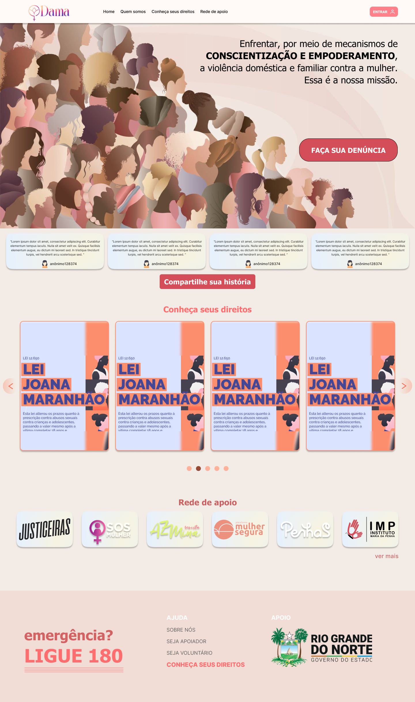
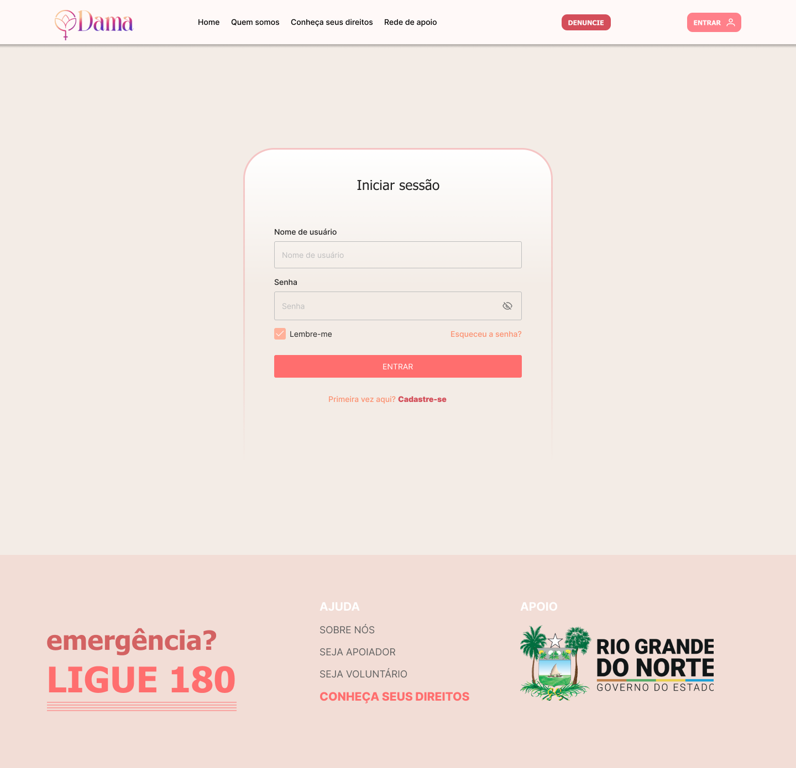
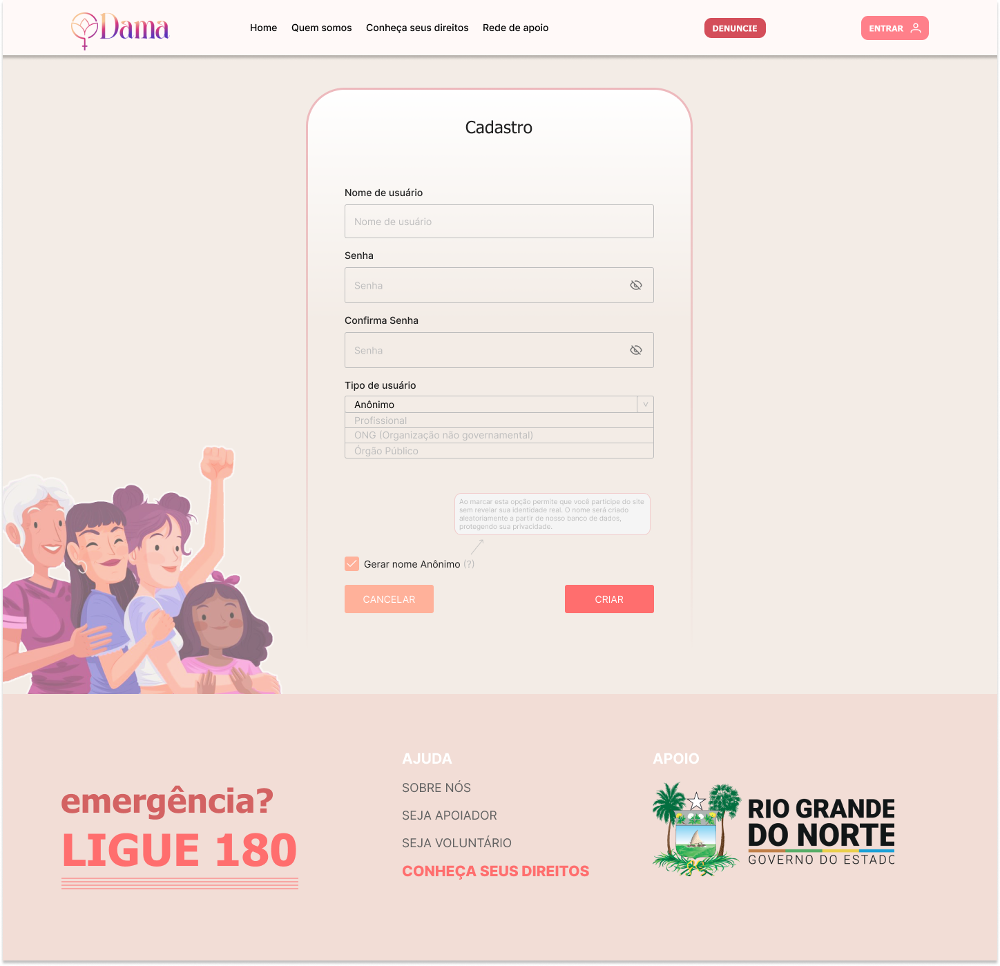
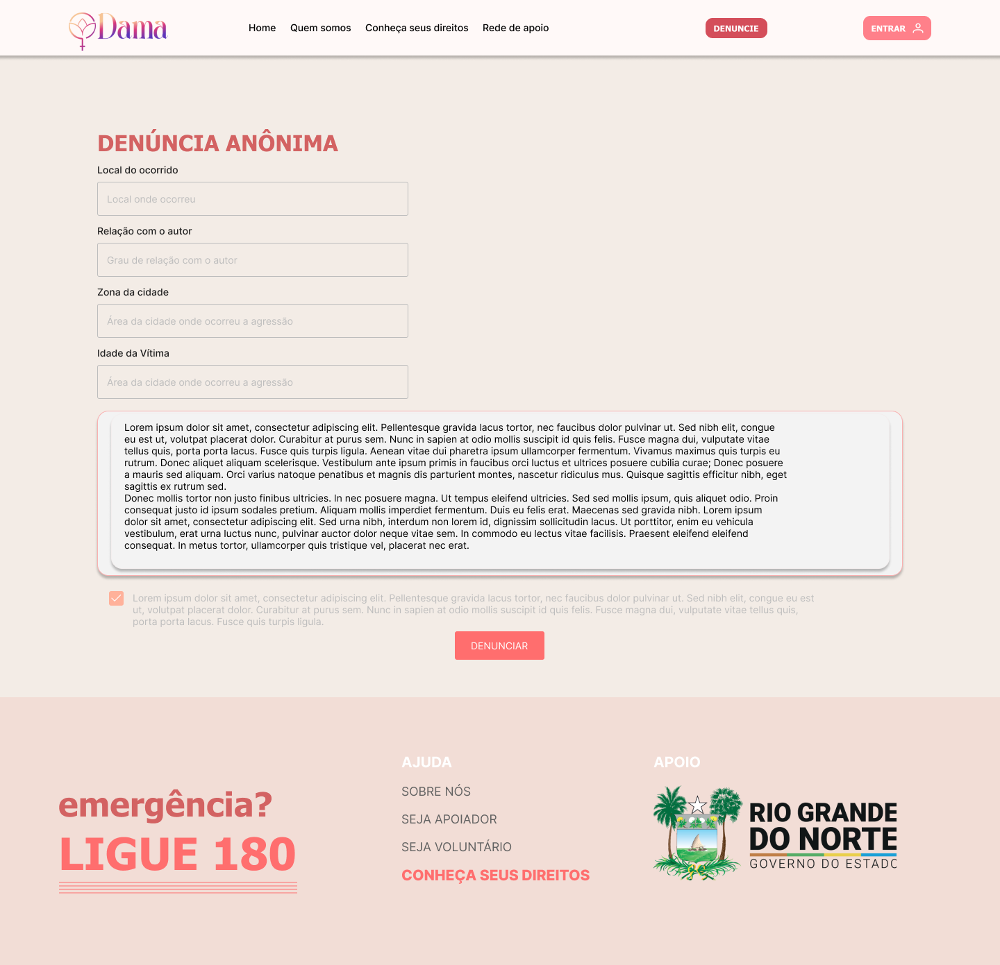
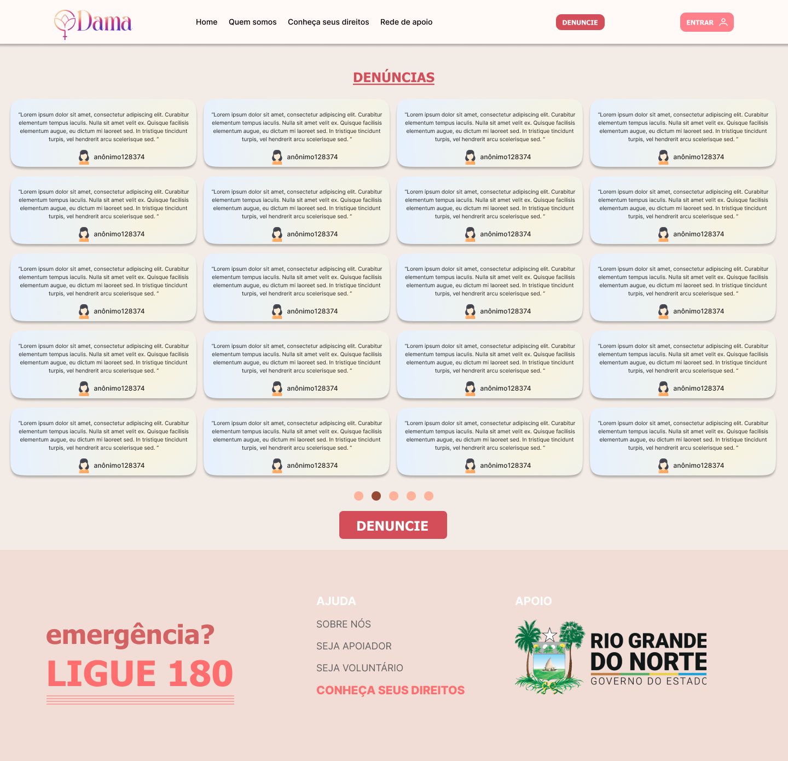
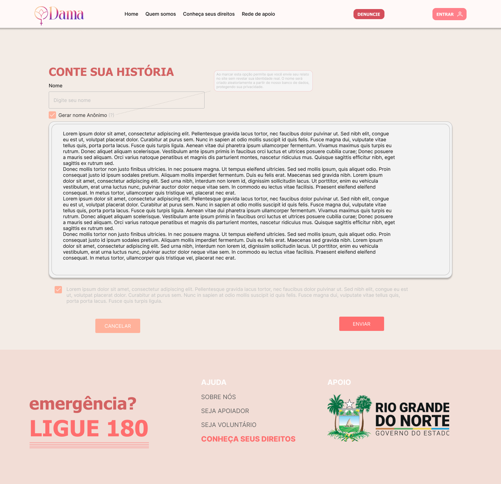
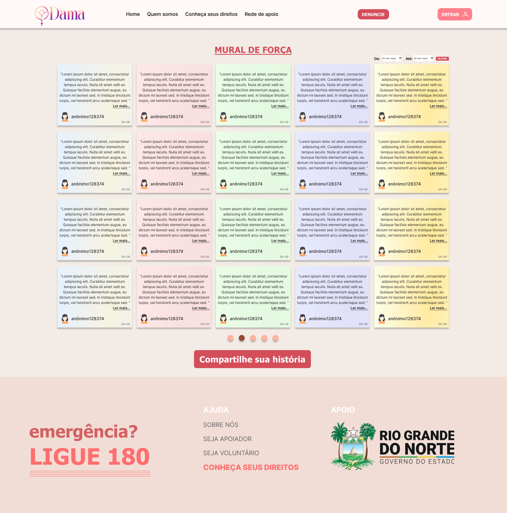
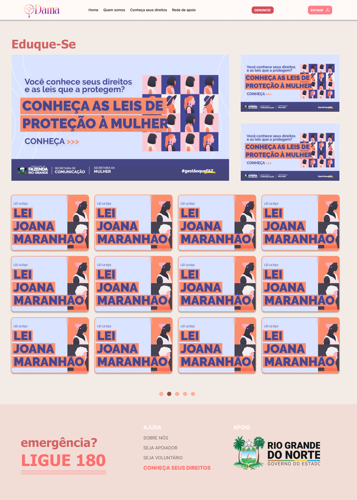
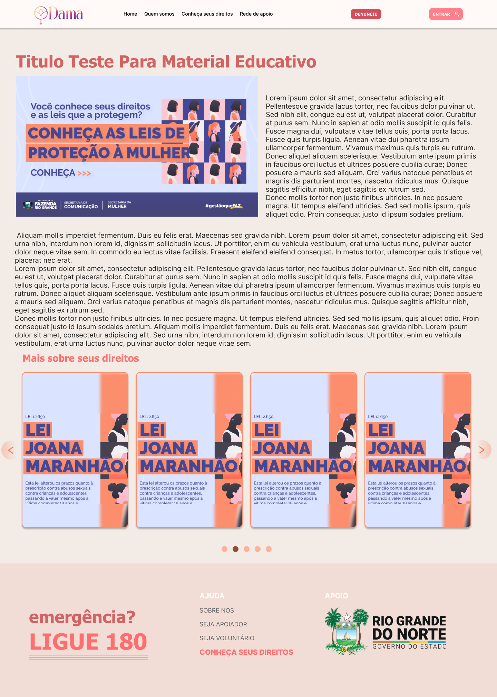

# Protótipos de Interface com o Usuário

<a href="https://www.figma.com/design/W62QlLFRQpgCdGsHthlvkm/DAMA---PDS-Projeto-2024.1?node-id=93-716&t=dI5VovFqnU586P0P-1"> Link para o Figma </a>

## Mapa do Site

## A. Tela 1: Index

## B. Tela 2: Login

## C. Tela 3: Cadastro

## D. Tela 4: Cadastro Denúncia

## E. Tela 5: Exposição Denúncias

## F. Tela 6: Cadastro Relato

## G. Tela 7: Exposição Relatos

## H. Tela 8: Materiais educativos

## I. Tela 9: Material educativo detalhado

